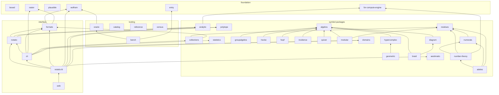

# Design: the workspace packages

Status: **reference**. What each workspace package is for, which side of the
enumeratio/notatio line it sits on (AGENTS.md, "Names"), and how the packages depend on
each other. Each `package.json` is the source of truth; this is the map, not the census.

## 1. Where packages live

- `packages/symbols/<group>/<package>/` — the symbol packages: heads declared on
  compute-engine, grouped by subject (`arithmetic`, `analysis`, `combinatorics`,
  `algebras`, `groups`, `evaluation`). The group is a directory, not a package.
- `packages/<name>/` — shared plumbing, the reference and oracle tooling, and the
  interface.
- `packages/components/<group>/` — reserved for a group's own renderers
  ([examples-as-data.md](./examples-as-data.md) §7). A group gets one the day it has its
  first renderer; until then every component lives in `notatio-lit`.
- `upstream/compute-engine/` — `@enumeratio/for-compute-engine`, patches offered to
  compute-engine ([upstreaming.md](./upstreaming.md) §10).
- `tools/perf/` — `@enumeratio/perf-tools`, advisory CI perf drift.
- `web/` — `@enumeratio/web`, the docs site.

Package names are independent of paths, and not all of them have caught up with the
naming split; renames wait ([component-naming.md](./component-naming.md)).

## 2. The graph

Runtime dependencies only (`dependencies`). `boxed` is left out: nearly every package that
touches the engine uses it. Dev-only edges are in §4.

`web` depends on the interface packages and every symbol package it documents;
`reference` and `census` reach every symbol package through devDependencies. Both are
drawn bare to keep the picture legible.

## 3. The packages

Side: **e** = enumeratio (meaning: declaring and evaluating, and checking that evaluation);
**n** = notatio (writing and showing); **—** = repo tooling, neither.

### Foundation

| Package              | Purpose                                                                                                 | Side | Depends on |
| -------------------- | ------------------------------------------------------------------------------------------------------- | ---- | ---------- |
| `boxed`              | Checked accessors for compute-engine `BoxedExpression`s (operands, integers, strings) instead of casts. | e    | —          |
| `entry`              | The shape of a reference entry and its implementations block. A leaf, so head owners can type entries.  | e    | —          |
| `plausible`          | Seeded, size-aware generators for the Plausible property sampler. A leaf.                               | e    | —          |
| `wolfram`            | MathJSON → Wolfram Language transpiler, a compute-engine compile target, used to cross-check.           | e    | —          |
| `raster`             | SVG → PNG via resvg, no DOM (Wolfram's `Rasterize`) for Node.                                           | n    | —          |
| `for-compute-engine` | Heads and fixes compute-engine would plausibly take, kept apart so landing upstream is a deletion.      | e    | —          |

### Symbol packages

| Package         | Group         | Purpose                                                                                               | Depends on                                   |
| --------------- | ------------- | ----------------------------------------------------------------------------------------------------- | -------------------------------------------- |
| `residues`      | arithmetic    | ℤ/m: residues, CRT, factoring, roots, discrete logs, `IntegerMod`.                                    | —                                            |
| `numerals`      | arithmetic    | Numeral systems: `IntegerDigits`/`FromDigits` over radix, mixed-radix, factoradic, Zeckendorf, …      | `residues`                                   |
| `number-theory` | arithmetic    | Past ℤ/m: Gaussian integers, rational reconstruction, Hermite normal form, valuations.                | `residues`, `numerals`, `for-compute-engine` |
| `adeles`        | arithmetic    | Profinite numbers, adèles and idèles over ℚ (port of Hertogh's Sage `adeles`).                        | `residues`, `numerals`, `number-theory`      |
| `analytic`      | analysis      | Special functions: Hurwitz zeta and friends.                                                          | `for-compute-engine`                         |
| `collections`   | combinatorics | Lazy indexed combinatorial collections (`Combinations`, `Subsets`, `Tuples`, …).                      | `residues`, `formats`                        |
| `domains`       | combinatorics | Carrier domains as nominal types; held constructors so a value carries its domain.                    | —                                            |
| `statistics`    | combinatorics | Combinatorial statistics and maps, defined in Epsil over their carriers.                              | —                                            |
| `polytope`      | combinatorics | Polytopes as face posets, with a projection into scene space.                                         | —                                            |
| `algebra`       | algebras      | The shared algebra seam: `Basis`, `AlgebraDimension`, the ordered product, dispatched over providers. | —                                            |
| `hypercomplex`  | algebras      | Multicomplex, split, dual and Clifford units as subscripted symbols.                                  | `algebra`                                    |
| `geometric`     | algebras      | Geometric algebra over `hypercomplex`: grades, outer/regressive products, contractions, duals.        | `hypercomplex`                               |
| `diagram`       | algebras      | Partition algebra and its subalgebras (Brauer, Temperley–Lieb, Motzkin, rook).                        | `algebra`                                    |
| `groupalgebra`  | algebras      | Cyclic, dihedral and product groups; their group algebras, classes, centres.                          | `algebra`                                    |
| `hecke`         | algebras      | Iwahori–Hecke algebra over ℤ[q].                                                                      | `algebra`                                    |
| `hopf`          | algebras      | NSym and QSym with product, coproduct, antipode.                                                      | `algebra`                                    |
| `incidence`     | algebras      | Finite posets, zeta and Möbius functions, Möbius inversion.                                           | `algebra`                                    |
| `quiver`        | algebras      | Quivers, paths, the path algebra kQ.                                                                  | `algebra`                                    |
| `braid`         | groups        | Braid groups, Burau, Alexander polynomials, torus knots, Lorenz braids.                               | `algebra`, `diagram`                         |
| `modular`       | groups        | PSL(2,ℤ): S/T and L/R words, continued fractions, Stern–Brocot, Rademacher symbol.                    | `algebra`, `residues`                        |
| `aestimatio`    | evaluation    | Controlling evaluation: cancellation, `TimeConstrained`, `MemoryConstrained`, isolated evaluators.    | —                                            |

All are enumeratio. `collections` → `formats` is the one edge from a symbol package into
the interface side.

### Tooling

| Package      | Purpose                                                                                                                                   | Side | Depends on                                                                     |
| ------------ | ----------------------------------------------------------------------------------------------------------------------------------------- | ---- | ------------------------------------------------------------------------------ |
| `reference`  | Loads every head's records (`referenceData`) and runs every example against the full engine; home of compute-engine's own heads' entries. | e    | dev: the symbol packages, `entry`, `oracle`, `plausible`, `wolfram`, `catalog` |
| `oracle`     | Cross-checks the reference against external systems: mappings, emitters, batch runners, accepted values.                                  | e    | `wolfram`                                                                      |
| `bench`      | Cross-system benchmarks: cases as data, scripts emitted per system through the oracle.                                                    | e    | `oracle`, `entry`                                                              |
| `catalog`    | The catalogue as resolvable resources: lazy context namespaces, a search path, the promotion ladder.                                      | e    | —                                                                              |
| `census`     | Every package in one engine: what we declare, what collides, what Wolfram has that we don't.                                              | e    | dev: the symbol packages and most tooling                                      |
| `utils`      | Repo-wide guard tests (e.g. no snapshots).                                                                                                | —    | —                                                                              |
| `perf-tools` | Advisory perf drift for CI.                                                                                                               | —    | —                                                                              |

### Interface

| Package       | Purpose                                                                                                                                                    | Side | Depends on                                                                              |
| ------------- | ---------------------------------------------------------------------------------------------------------------------------------------------------------- | ---- | --------------------------------------------------------------------------------------- |
| `formats`     | Wolfram-style format registry: `Import`/`Export` over MathJSON, Wolfram, TeX, code, images.                                                                | n    | `wolfram`, `raster`                                                                     |
| `notatio`     | The base: symbol → component map and lowering, the vdom, the control contract, pure SVG renderers; `./vue` and `./react` glue. No UI framework of its own. | n    | `formats`, `analytic`, `polytope`                                                       |
| `notatio-lit` | The `<notatio-*>` web components (Lit): everything that draws or controls, the notebook, the editors.                                                      | n    | `notatio`, `cli`, `formats`, `wolfram`, `analytic`, `polytope`, `domains`, `aestimatio` |
| `cli`         | The REPL and one-shot evaluator, with terminal show mode.                                                                                                  | n    | `notatio`, `formats`, `raster`, `collections`, `domains`, `statistics`                  |
| `web`         | The docs site (VitePress): guide, reference, explore, playground.                                                                                          | n    | the interface and symbol packages                                                       |

## 4. Dev-only edges and `vp run -r`

`vp run -r <task>` orders packages by the `package.json` graph **including
devDependencies**, and fails outright on a cycle, even when one side has no such task.
There is no escape hatch: `ignoreWorkspaceCycles` was dropped from CI once the last cycle
was broken, so a new cycle breaks every recursive run.

The dev-only edges that matter:

- `reference` and `census` devDepend on the symbol packages to aggregate them, so a symbol
  package must never depend on either, not even for a type. Entry types come from `entry`;
  anything that needs every entry at once lives in `reference`.
- `collections`, `domains` and `statistics` devDepend on `entry` and `plausible` for their
  record and sampling tests; `domains` and `statistics` also on `catalog` and
  `collections`.
- The algebra providers devDepend on `hypercomplex` for tests; several symbol packages
  devDepend on `oracle` for their goldens.
- `notatio` devDepends on `reference`, `oracle`, `entry`, `wolfram` and `braid` for its
  form collection and tests.

Before adding a devDependency, check whether the target already (transitively) depends on
you. If it does, move the shared piece into a leaf — the way `entry` and `plausible` were
split out.

## 5. Names that are easy to confuse

- **`boxed` vs `boxes`.** `boxed` is plumbing for compute-engine's `BoxedExpression` — the
  engine's word for a canonicalised expression object. It has nothing to do with
  presentation. `boxes` (being added) is Wolfram-style `*Box` presentation primitives
  (`RowBox`, `FractionBox`, …): notatio, the showing side.
- **`notatio` vs `notatio-lit`.** `notatio` is the framework-free base (vdom, lowering,
  control contract, Vue and React glue as subpaths); `notatio-lit` is the Lit elements
  built on it. The Vue and React wrappers are not separate packages.
- **`reference` vs `entry`.** `entry` is only the record shape, a leaf; `reference` is the
  loaded data and the runner, and depends on everything.
- **`catalog` vs `census` vs `reference`.** `catalog` resolves names at runtime (namespaces,
  search path); `census` audits the whole namespace for collisions and gaps; `reference`
  holds documentation and examples.
- **`wolfram` vs `formats`.** `wolfram` transpiles MathJSON to Wolfram Language; `formats`
  is the `Import`/`Export` registry that uses it as one format among several.
- **`algebra` vs `algebras`.** `@enumeratio/algebra` is the seam package; `algebras` is the
  directory grouping it with its providers.
- **`residues` / `numerals` / `number-theory`.** ℤ/m kernels live in `residues`, digit
  systems in `numerals`, everything past ℤ/m in `number-theory`, in that dependency order.
- **`domains` vs `collections`.** A domain is a carrier type whose values know their
  domain; a collection is a lazy indexed enumeration of values.
- **`aestimatio`** is evaluation control (deadlines, cancellation, isolation), not
  estimation.
- **`plausible`** is our property sampler (after Lean 4's Plausible), not web analytics.
- **`for-compute-engine`** is ours, under `upstream/`, not a fork of compute-engine.
