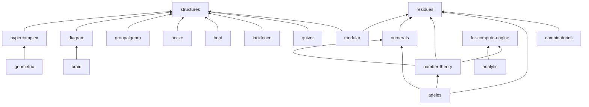
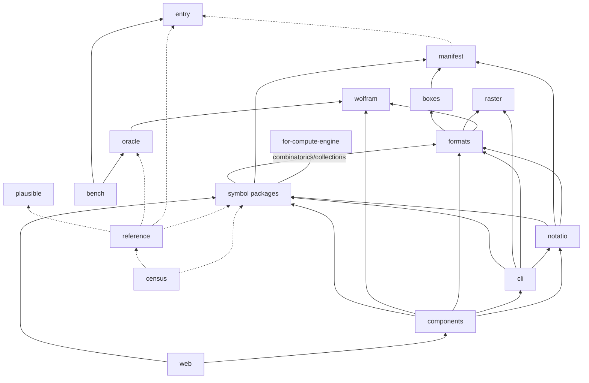

# Design: the workspace packages

Status: **reference**. What each workspace package is for, which side of the
enumeratio/notatio line it sits on (AGENTS.md, "Names"), and how the packages depend on
each other. Each `package.json` is the source of truth; this is the map, not the census.

## 1. Where packages live

- `packages/symbols/<group>/<package>/` — the symbol packages: heads declared on
  compute-engine, grouped by subject (`arithmetic`, `analysis`, `combinatorics`,
  `algebras`, `groups`, `evaluation`). The group is a directory, not a package.
- `packages/<name>/` — shared plumbing, the reference and oracle tooling, and the
  interface.
- `packages/symbols/<group>/components/` — reserved for a group's own renderers
  (`@enumeratio/<group>-components`, [examples-as-data.md](./examples-as-data.md) §7). A
  group gets one the day it has its first renderer; until then every component lives in
  `packages/components/`.
- `upstream/compute-engine/` — `@enumeratio/for-compute-engine`, patches offered to
  compute-engine ([upstreaming.md](./upstreaming.md) §10).
- `tools/perf/` — `@enumeratio/perf-tools`, advisory CI perf drift.
- `web/` — `@enumeratio/web`, the docs site.

Package names are independent of paths, and not all of them have caught up with the
naming split; renames wait ([component-naming.md](./component-naming.md)).

## 2. The graph

`boxed` is left out of both pictures: nearly every package that touches the engine uses it.
Solid edges are `dependencies`; dotted ones are devDependencies (the rest are in §4).

The symbol packages among themselves. `statistics`, `polytope` and `evaluation` stand
alone. `combinatorics` (merged `collections` + `domains`,
[combinatorics-layering-and-plausible.md](./speculative/combinatorics-layering-and-plausible.md))
is one package with a subpath per area: `./collections`, `./domains`.

Everything else, with the symbol packages as one box:

## 3. The packages

Side: **e** = enumeratio (meaning: declaring and evaluating, and checking that evaluation);
**n** = notatio (writing and showing); **—** = repo tooling, neither.

### Foundation

| Package              | Purpose                                                                                                                                           | Side | Depends on   |
| -------------------- | ------------------------------------------------------------------------------------------------------------------------------------------------- | ---- | ------------ |
| `boxed`              | Checked accessors for compute-engine `BoxedExpression`s (operands, integers, strings) instead of casts.                                           | e    | —            |
| `entry`              | The shape of a reference entry and its implementations block. A leaf, so head owners can type entries.                                            | e    | —            |
| `plausible`          | Seeded, size-aware generators for the Plausible property sampler. A leaf.                                                                         | e    | —            |
| `wolfram`            | MathJSON → Wolfram Language transpiler, a compute-engine compile target, used to cross-check.                                                     | e    | —            |
| `raster`             | SVG → PNG via resvg, no DOM (Wolfram's `Rasterize`) for Node.                                                                                     | n    | —            |
| `for-compute-engine` | Heads and fixes compute-engine would plausibly take, kept apart so landing upstream is a deletion.                                                | e    | —            |
| `manifest`           | Every head's metadata (packages, overloads and types, parameters, summary), built from the records. ([manifest.md](./manifest.md))                | e    | dev: `entry` |
| `structures`         | Structure as compute-engine protocols (orders, floors, algebras, after Mathlib) and the generic heads over it. ([structures.md](./structures.md)) | e    | `boxed`      |

### Symbol packages

| Package         | Group         | Purpose                                                                                                                                                                                                                 | Depends on                                   |
| --------------- | ------------- | ----------------------------------------------------------------------------------------------------------------------------------------------------------------------------------------------------------------------- | -------------------------------------------- |
| `residues`      | arithmetic    | ℤ/m: residues, CRT, factoring, roots, discrete logs, `IntegerMod`.                                                                                                                                                      | —                                            |
| `numerals`      | arithmetic    | Numeral systems: `IntegerDigits`/`FromDigits` over radix, mixed-radix, factoradic, Zeckendorf, …                                                                                                                        | `residues`                                   |
| `number-theory` | arithmetic    | Past ℤ/m: Gaussian integers, rational reconstruction, Hermite normal form, valuations.                                                                                                                                  | `residues`, `numerals`, `for-compute-engine` |
| `adeles`        | arithmetic    | Profinite numbers, adèles and idèles over ℚ (port of Hertogh's Sage `adeles`).                                                                                                                                          | `residues`, `numerals`, `number-theory`      |
| `analytic`      | analysis      | Special functions: Hurwitz zeta and friends.                                                                                                                                                                            | `for-compute-engine`                         |
| `combinatorics` | combinatorics | Merged `collections` + `domains`, one package, `./collections` and `./domains` subpaths: lazy indexed collections (`Combinations`, `Subsets`, `Tuples`, …) and carrier domains as nominal types with held constructors. | `residues`, `formats`                        |
| `statistics`    | combinatorics | Combinatorial statistics and maps, defined in Epsil over their carriers.                                                                                                                                                | —                                            |
| `polytope`      | combinatorics | Polytopes as face posets, with a projection into scene space.                                                                                                                                                           | —                                            |
| `hypercomplex`  | algebras      | Multicomplex, split, dual and Clifford units as subscripted symbols.                                                                                                                                                    | `structures`                                 |
| `geometric`     | algebras      | Geometric algebra over `hypercomplex`: grades, outer/regressive products, contractions, duals.                                                                                                                          | `hypercomplex`                               |
| `diagram`       | algebras      | Partition algebra and its subalgebras (Brauer, Temperley–Lieb, Motzkin, rook).                                                                                                                                          | `structures`                                 |
| `groupalgebra`  | algebras      | Cyclic, dihedral and product groups; their group algebras, classes, centres.                                                                                                                                            | `structures`                                 |
| `hecke`         | algebras      | Iwahori–Hecke algebra over ℤ[q].                                                                                                                                                                                        | `structures`                                 |
| `hopf`          | algebras      | NSym and QSym with product, coproduct, antipode.                                                                                                                                                                        | `structures`                                 |
| `incidence`     | algebras      | Finite posets, zeta and Möbius functions, Möbius inversion.                                                                                                                                                             | `structures`                                 |
| `quiver`        | algebras      | Quivers, paths, the path algebra kQ.                                                                                                                                                                                    | `structures`                                 |
| `braid`         | groups        | Braid groups, Burau, Alexander polynomials, torus knots, Lorenz braids.                                                                                                                                                 | `algebra`, `diagram`                         |
| `modular`       | groups        | PSL(2,ℤ): S/T and L/R words, continued fractions, Stern–Brocot, Rademacher symbol.                                                                                                                                      | `algebra`, `residues`                        |
| `evaluation`    | evaluation    | Controlling evaluation: cancellation, `TimeConstrained`, `MemoryConstrained`, isolated evaluators.                                                                                                                      | —                                            |

All are enumeratio. `combinatorics` (its `collections` area) → `formats` is the one edge
from a symbol package into the interface side.

### Tooling

| Package      | Purpose                                                                                                                                   | Side | Depends on                                                                     |
| ------------ | ----------------------------------------------------------------------------------------------------------------------------------------- | ---- | ------------------------------------------------------------------------------ |
| `reference`  | Loads every head's records (`referenceData`) and runs every example against the full engine; home of compute-engine's own heads' entries. | e    | dev: the symbol packages, `entry`, `oracle`, `plausible`, `wolfram`, `catalog` |
| `oracle`     | Cross-checks the reference against external systems: mappings, emitters, batch runners, accepted values.                                  | e    | `wolfram`                                                                      |
| `bench`      | Cross-system benchmarks: cases as data, scripts emitted per system through the oracle.                                                    | e    | `oracle`, `entry`                                                              |
| `catalog`    | The catalogue as resolvable resources: lazy context namespaces, a search path, the promotion ladder.                                      | e    | —                                                                              |
| `census`     | Every package in one engine: what we declare, what collides, what Wolfram has that we don't.                                              | e    | dev: the symbol packages and most tooling                                      |
| `utils`      | Repo-wide guard tests (e.g. no snapshots).                                                                                                | —    | —                                                                              |
| `perf-tools` | Advisory perf drift for CI.                                                                                                               | —    | —                                                                              |

### Interface

| Package      | Purpose                                                                                                                                                    | Side | Depends on                                                                                    |
| ------------ | ---------------------------------------------------------------------------------------------------------------------------------------------------------- | ---- | --------------------------------------------------------------------------------------------- |
| `boxes`      | Wolfram-style `*Box` presentation primitives, `makeBoxes`, and their MathML / LaTeX / text serialisers ([boxes.md](./boxes.md)).                           | n    | `manifest`                                                                                    |
| `formats`    | Wolfram-style format registry: `Import`/`Export` over MathJSON, Wolfram, TeX, code, images.                                                                | n    | `wolfram`, `raster`, `boxes`                                                                  |
| `notatio`    | The base: symbol → component map and lowering, the vdom, the control contract, pure SVG renderers; `./vue` and `./react` glue. No UI framework of its own. | n    | `formats`, `manifest`, `analytic`, `polytope`                                                 |
| `components` | The `<notatio-*>` custom elements, built with Lit: everything that draws or controls, the notebook, the editors.                                           | n    | `notatio`, `cli`, `formats`, `wolfram`, `analytic`, `polytope`, `combinatorics`, `evaluation` |
| `cli`        | The REPL and one-shot evaluator, with terminal show mode.                                                                                                  | n    | `notatio`, `formats`, `raster`, `combinatorics`, `statistics`                                 |
| `web`        | The docs site (VitePress): guide, reference, explore, playground.                                                                                          | n    | the interface and symbol packages                                                             |

## 4. Dev-only edges and `vp run -r`

`vp run -r <task>` orders packages by the `package.json` graph **including
devDependencies**, and fails outright on a cycle, even when one side has no such task.
There is no escape hatch: `ignoreWorkspaceCycles` was dropped from CI once the last cycle
was broken, so a new cycle breaks every recursive run.

The dev-only edges that matter:

- `reference` and `census` devDepend on the symbol packages to aggregate them, so a symbol
  package must never depend on either, not even for a type. Entry types come from `entry`;
  anything that needs every entry at once lives in `reference`.
- `combinatorics` and `statistics` devDepend on `entry` and `plausible` for their record
  and sampling tests. `combinatorics`' domains area also devDepends on `statistics` for
  cross-package integration tests. Merging `collections` and `domains` into `combinatorics`
  would otherwise have folded two prior non-cyclic edges (`domains` → `catalog`,
  `catalog` → `collections`; `domains` → `statistics`, `statistics` → `catalog`) into
  `combinatorics` ↔ `catalog` and `catalog` ↔ `combinatorics` ↔ `statistics` cycles, so the
  catalog-dependent tests that caused the reverse edges (a carrier fallback check, a
  catalog-coverage drift check) moved into `catalog`'s own suite instead — `catalog` now
  devDepends on `combinatorics` and `statistics`, neither of which depends back on it.
- The algebra providers devDepend on `hypercomplex` for tests; several symbol packages
  devDepend on `oracle` for their goldens.
- `notatio` devDepends on `reference`, `oracle`, `entry`, `wolfram` and `braid` for its
  form collection and tests.

Before adding a devDependency, check whether the target already (transitively) depends on
you. If it does, move the shared piece into a leaf — the way `entry` and `plausible` were
split out.

## 5. Names that are easy to confuse

- **`boxed` vs `boxes`.** `boxed` is plumbing for compute-engine's `BoxedExpression` — the
  engine's word for a canonicalised expression object. It has nothing to do with
  presentation. `boxes` is Wolfram-style `*Box` presentation primitives (`RowBox`,
  `FractionBox`, …): notatio, the showing side.
- **`notatio` vs `components`.** `notatio` is the framework-free base (vdom, lowering,
  control contract, Vue and React glue as subpaths); `components` is the Lit elements
  built on it. The Vue and React wrappers are not separate packages.
- **`reference` vs `entry`.** `entry` is only the record shape, a leaf; `reference` is the
  loaded data and the runner, and depends on everything.
- **`catalog` vs `census` vs `reference`.** `catalog` resolves names at runtime (namespaces,
  search path); `census` audits the whole namespace for collisions and gaps; `reference`
  holds documentation and examples.
- **`wolfram` vs `formats`.** `wolfram` transpiles MathJSON to Wolfram Language; `formats`
  is the `Import`/`Export` registry that uses it as one format among several.
- **`residues` / `numerals` / `number-theory`.** ℤ/m kernels live in `residues`, digit
  systems in `numerals`, everything past ℤ/m in `number-theory`, in that dependency order.
- **`combinatorics`' `domains` vs `collections` subpaths.** A domain is a carrier type
  whose values know their domain; a collection is a lazy indexed enumeration of values.
  One package, two areas, merged wholesale ahead of carving by area.
- **`evaluation`** is evaluation control (deadlines, cancellation, isolation), not
  estimation.
- **`plausible`** is our property sampler (after Lean 4's Plausible), not web analytics.
- **`for-compute-engine`** is ours, under `upstream/`, not a fork of compute-engine.
