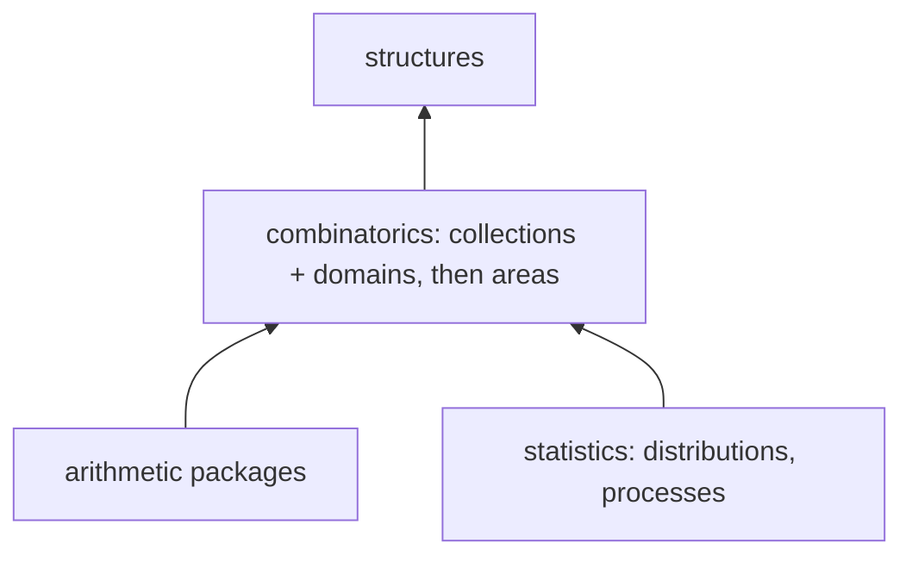

# Design: each area owns its carriers; Plausible as symbols

Status: **speculative** (lane A-80). Two linked proposals: re-layer the combinatorial packages so
a carrier sits beside its families, statistics and maps (§1–§4), then re-express Plausible as a
composition of heads over those typed values (§5–§8). Nothing here is built. Sequenced after
#401 and after A-78 finishes typing the remaining families.

## In one screen

- **One package, `@enumeratio/combinatorics`, one subpath per area** (permutations, partitions,
  compositions, words, lattice paths, trees, set partitions, tableaux, …). An area module owns
  its carrier types and constructors, its families, its statistics and maps, and its records.
- **Carriers are declared before families, in the same call**, so typed elements are the
  default. The `carrierTypes` option and #389's `collectionCarrierOf` wrap retire.
- **Merge first, carve later.** `collections` and `domains` merge into `combinatorics` as they
  are; what belongs elsewhere (arithmetic families and carriers, the generic list heads) is
  pieced out afterwards. No boundary between them is kept just because it exists today.
- **Carrier rule:** a form is a carrier when it is counted and ordered in its own right, and a
  representation when it only prints and parses the same value (§2). Conversions between
  carriers are overloads of the target's constructor, not heads.
- **Order is first-class.** A carrier has no order; a collection is a carrier plus a total
  order, and states it. Sibling collections exist for distinct useful orders (§2).
- **A property is an Epsil statement**, `ForAll(Element(x, D), P)`. `FindCounterexample`
  samples it through `Random`, shrinks what fails and returns counterexamples as values.
  `VerificationTest` turns that into a pass or fail. Laws are data on the records.
- The harness keeps what works: families declare capabilities and cost, the standard run
  has a small budget, deep runs go nightly, the rolling issue stays, and the oracle
  Plausible stays. The difference is that the checks are the heads a notebook uses.

## 1. Why the current layering is backwards

`collections` holds every family and sits below `domains`, which mints the carriers. A family
can't name its element type, so each host (CLI, site, reference, census) calls
`declareDomains`, then `declareCollections(ce, { carrierTypes })`, then the plurals and
`Element`, then statistics and maps, in an order it has to keep straight itself (#385, #396,
#400). An engine that skips the option gets bare `["List", …]` rows. #389 wraps those rows in
their carrier where they're used. Maps live in `domains`, statistics in `statistics`, and
permutation kernels in `collections`. `collections` and `domains` can't depend on each other,
so the same tree conversion is written twice (#401).

The inhabitant is more basic than a collection of inhabitants. The dependency should say so.

Two surveys fed the proposal:

- **`collections` is mostly not combinatorics.** Besides the families it holds list and
  Wolfram list operations, graphs, generating functions, infinite products and rounding and
  arithmetic widenings. Its numeric families (primes, recurrences, digit sequences) have
  integer elements and no carrier.
- **Not every carrier in `domains` is combinatorial.** The data is extracted from the archived
  enumeratio's SQL composite types. It includes arithmetic values (`GaussianInteger`,
  `ModularResidue`, `RationalNumber`, `Fraction`, the factorizations, `ContinuedFraction`,
  `EgyptianFraction`), tooling records (`FindStatHit`, `DistributionMatchHit`) and a notatio
  type (`GlyphKind`).

## 2. The carrier rule

> A form is a **carrier** when it is a family counted and ordered in its own right, with its
> own collection. It is a **representation** when it only prints and parses the same value
> (render and parse, design/domains.md §3).

- How cheap the conversion is doesn't decide it. With statistics and maps shared across
  equivalences, an extra carrier costs one converter pair and buys a typed collection and a
  checked order claim. Growth strings, surjections, binary trees' parent arrays and
  permutations in cycle notation are carriers; a partition's frequency form is a
  representation.
- **Conversions are constructor overloads.** Two carriers are joined by a converter pair with
  an `{inverse}` law, written as the target's constructor on the source's value:
  `SetPartition(RestrictedGrowthString([0, 1, 0, 2]))`, `DyckPath(tree)`. The same conversion
  is reached as `CombinatorialMap(x, DyckPaths)` (by the target collection) or by FindStat id.
  A named map is for a bijection with an identity of its own, not for every pair (#401).
- **Order is first-class.** A carrier doesn't care about order; a collection is a carrier plus
  a total order, and it can't enumerate consistently without one. Each collection states its
  order. Sibling collections exist for distinct _useful_ orders over one carrier, or over
  sibling carriers (`BinaryTrees` by root split, `DyckPaths` in lex order). Where a conversion
  happens to match two collections' orders it says so (`orderIsomorphism`), and
  `domains/tests/equivalence.test.ts` checks it, but that is a claim, not a goal.
- **A restriction is not a carrier** (design/domains.md §4). `Derangements` holds
  permutations.

Applied to what exists:

| carriers                                                                             | verdict                                                                                                                                                                                                                                                                                                                                          |
| ------------------------------------------------------------------------------------ | ------------------------------------------------------------------------------------------------------------------------------------------------------------------------------------------------------------------------------------------------------------------------------------------------------------------------------------------------ |
| `BinaryTree`, `KAryTree`, `OrderedTree`, `PlaneTree`, `IncreasingBinaryTree`         | **Nested**. #401 makes `BinaryTree` nested and joins it to `DyckPath` by FindStat's Mp00012, a bijection (not order-preserving between `BinaryTrees` and `DyckPaths`). `OrderedTree` and `PlaneTree` are the same object and should fold into one carrier. `IncreasingBinaryTree` ↔ `Permutation` is nontrivial, so both stay, with a converter. |
| `BinaryTree` and `BinaryTreeParentArray` (#401)                                      | Two carriers: the parent arrays are a collection in `BinaryTrees`' order (#401).                                                                                                                                                                                                                                                                 |
| `DyckPath` with `BinaryTree`, `NonCrossingMatchings`, 321-avoiding `Permutation`s    | Nontrivial. Separate carriers, joined by order isomorphisms where they exist.                                                                                                                                                                                                                                                                    |
| `SetPartition` (blocks) and `RestrictedGrowthString`                                 | Two carriers (#396): growth strings are counted and ordered in their own right, order-isomorphic to `SetPartitions`.                                                                                                                                                                                                                             |
| `SetComposition` (blocks) and `Surjection`                                           | Two carriers, likewise.                                                                                                                                                                                                                                                                                                                          |
| `Composition` and its cut word                                                       | Settled. The cut word is a `BinaryWord`, a carrier in its own right (all binary words), reached by `CutWord` / `CompositionOfCutWord`.                                                                                                                                                                                                           |
| `Permutation` and `PermutationCycles`                                                | Two carriers: Wolfram's `Cycles` replaces the unused `permutation_cycles`, with a sibling collection of the permutations of n in cycle notation, ordered by cycle type (next, after #401).                                                                                                                                                       |
| `Permutation` and `SubexcedantSeq` (Lehmer code)                                     | Nontrivial. Both stay, joined by `ToLehmerCode` and its inverse.                                                                                                                                                                                                                                                                                 |
| `LabeledTree` and Prüfer sequences                                                   | Nontrivial. Both stay: the tree nested, the sequence as a word.                                                                                                                                                                                                                                                                                  |
| `IntegerPartition` and its frequency form                                            | Trivial. The frequency form is a representation (built).                                                                                                                                                                                                                                                                                         |
| `StandardTableau` (row word), `SemistandardTableau`, `SkewTableau`, `PlanePartition` | **Nested rows**. A reading word is a flattening, and the shape is the part that is hard to derive.                                                                                                                                                                                                                                               |
| `AlternatingSignMatrix`, `GelfandTsetlinPattern`                                     | Nested rows, for the same reason.                                                                                                                                                                                                                                                                                                                |
| `PerfectMatching`                                                                    | Pairs are its blocks, so it is a restriction of `SetPartition` rather than a carrier. Open question 1.                                                                                                                                                                                                                                           |

Storage follows the carrier, not the archive's SQL type: carrier-shapes.txt stops being the
source of truth.

## 3. The layout

Start by merging `collections` and `domains` into `combinatorics` as they are. The bullets
below are where the pieces end up once it is carved.

- **`combinatorics`** has one subpath export per area. The site imports only the areas a page
  needs; the site build is mostly bundling, so tree-shaking matters. A map between
  areas (RSK, Dyck ↔ tree) lives in the area its target depends on. Because this is one
  package, the dependency graph between areas never has to be acyclic. An area becomes its own
  package only when it gains dependencies of its own.
- **One declare call:** `declareCombinatorics(ce)`. It mints carriers, declares typed
  families, then plurals and `Element`, then statistics and maps, in the order the hosts
  repeat by hand today.
- **`collections`** keeps `FamilyKernel`, `declareFamilies` (without `carrierTypes`), the cost
  helpers and the generic heads. Its numeric families can stay: their elements are integers.
  A later move to arithmetic is optional and separate.
- **`domains`** keeps the machinery and no data. The arithmetic carriers move to the
  arithmetic packages that use them. `GlyphKind` moves to the notatio side. The FindStat hit
  records move to `statistics`' FindStat tooling. Renaming `domains` waits, like every rename
  (design/component-naming.md).
- **`structures`** is unchanged. Its registries (`registerCarrier`, `registerOperation`,
  `registerEquivalence`) become the seam areas meet at, not a bridge.
- The `collections` ↔ `domains` ↔ `statistics` devDependency tangle goes away, and with it
  the risk of a `vp run -r` cycle (design/packages.md §4).

## 4. Migration

Every step ships on its own. Each one must keep the reference run, the site build and the CLI
demo goldens green, with only a record's `library` field changing.

1. **Wait for #401 and A-78.** Every family that has a carrier is typed first. That makes
   typing a property of the family, not of this move.
2. **Merge `collections` and `domains`** into `combinatorics` wholesale (`git mv`, one
   package, both source trees intact). The devDependency between them goes, and with it the
   code written twice because neither could import the other (#401's tree conversion).
3. **One entry point.** Add `declareCombinatorics`, which for now calls the existing packages
   in the right order. Switch the CLI, site, reference and census engines to it. The hosts
   stop passing `carrierTypes`. No head moves.
4. **Carriers move, area by area.** Split `domain-data.ts` by area into `combinatorics` for the
   last time and retire the extractor. Leave re-exports in `domains` until the step finishes.
5. **Families move, area by area,** with their record folders (`git mv`, to keep history).
   Inside `combinatorics` a family's carrier is known when it's declared, so it's typed. Once
   the last carrier-bearing family has moved, `carrierTypes` is deleted.
6. **Statistics and maps move** with their generators. `scripts/entries.ts` and
   `collect-entries.ts` from both `statistics` and `domains` become one generator per area
   inside `combinatorics`. `writeEntries`' owned-heads mode already shares a folder with
   hand-written records, and each package's `generated.test.ts` drift test moves with its
   generator: a clean regeneration after the move proves nothing changed. The frontier stubs
   and FindStat data go with them. Map laws move from `map.ts` onto the map records (§6).
   Rerun `collect-forms` and the manifest once, at the end of each area.
7. **Retire the bridges.** Remove the #389 wrap in the collection table, and remove `laws.ts`'s
   kernel-to-carrier table. A guard test requires every family on a carrier to yield that
   carrier's type.
8. **The leftovers leave:** the arithmetic and notatio carriers move out, and `statistics`
   keeps only the distributions and processes.

## 5. Plausible as symbols

Today Plausible is a TypeScript harness (design/plausible.md). Families declare capabilities
and cost, `sampleable` derives an instance, and scripts check properties at sampled addresses.
The proposal keeps the declarations and moves the checking into heads. A property is an
expression. Sampling is `Random`. A check is evaluation. A counterexample is a value you can
retype.

| Lean 4 Plausible                    | Now                                              | As symbols                                                                                                                                                                                             |
| ----------------------------------- | ------------------------------------------------ | ------------------------------------------------------------------------------------------------------------------------------------------------------------------------------------------------------ |
| `Gen`, `Arbitrary`, `SampleableExt` | `Gen`, `sampleable(family)`, address as proxy    | `Random(D)` (#351). A family samples itself by `count` and `at`. A plural (a carrier's type space) samples the union of its families at a size, which is the Sum instance of design/plausible.md §4.2. |
| size                                | the runner's ramp                                | a size option on `Random` over an unbounded domain (open question 3)                                                                                                                                   |
| `Shrinkable`                        | generic, on the address                          | `Shrink(x, D)`: the members of `D` smaller than `x`. Params go toward their minimum, then rank toward 0, through `IndexOf` and `At`. A carrier may conform with a member of its own.                   |
| `Testable`                          | `Property.check`                                 | the statement `ForAll(Element(x, D), P)`. A failed guard in `Implies(G, P)` is a discard (Lean's `gaveUp`).                                                                                            |
| the run                             | `plausible.ts`                                   | `FindCounterexample(statement, n?, options)`: shrunk assignments, `[[x -> v]]`, or `[]` if none turned up within the budget                                                                            |
| `TestResult`                        | `Failure` records                                | `VerificationTest(FindCounterexample(s), [])` → `TestResultObject`. Many of them roll up into `TestReport`.                                                                                            |
| `Configuration`                     | `points`, `maxSize`, `retries`, `seed`, `budget` | options: a point count, a maximum size, retries, `WithRandomSeed`, and `TimeConstrained`/`MemoryConstrained` from `evaluation`                                                                         |

Notes:

- **compute-engine's `ForAll` already decides finite domains**, exhaustively: over
  `Range(1, 5)` it answers `True` or `False`, and over an infinite domain it stays symbolic.
  `FindCounterexample` takes over the rest. It enumerates a finite `D` whenever the declared
  cost and the enumeration limit allow it (SmallCheck's strength), and samples otherwise. An
  over-budget draw is a discard, not a failure.
- **Why not `FindInstance(Not(P), …)`?** Our `FindInstance` returns `[]` only when
  infeasibility is proven. A sampled search can't prove anything, so a different head keeps
  that contract honest.
- **`Sample` is the `Sampleable` protocol's member**, and `Random` dispatches to it.
  `registerSampler` remains the stand-in until compute-engine releases the `Self` binding and
  `ce.conformsTo` (the protocol-self-target work). It is a bridge in the same sense as
  `collectionCarrierOf`.
- **A counterexample is a value.** Substituting it back and evaluating reproduces the failure,
  so the replay line is the counterexample written in Epsil. The seed and address remain as
  metadata.
- **Cost stays declared on the kernels** (§3.3 of design/plausible.md). The symbol layer sees it
  as `Random` and `At` declining past the budget (phase 8 there).

## 6. Where the laws come from

A trait contributes statements. `Laws(D)` returns every statement that applies to `D`, so
`Map(Laws(Permutations), FindCounterexample)` is Plausible over one carrier, run in a
notebook.

- **Protocols.** A protocol's record carries `laws:` as Epsil text over `Self`, for example
  antisymmetry for `PartialOrder` or the Galois connection for `FloorOrder`. A type's
  conformance instantiates `Self` with the type's space. `refines` brings in the parents'
  laws. The laws are data on the records, not MathJSON written by hand in `protocols.ts`,
  which matches statistics as metadata and examples as data.
- **Collections.** The capability table in design/plausible.md §4.1 becomes the laws of a
  ranked-collection protocol, quantified over the family's parameters and then its
  positions. That nesting is the Σ type:
  - membership: `Element(At(F(p), k), F(p))`;
  - round trip: `IndexOf(F(p), At(F(p), k)) = k`;
  - count against enumeration, under a cap;
  - non-members.
- **Maps.** A map record keeps the shorthand vocabulary (`involution`, `idempotent`,
  `{inverse: g}`, `orderIsomorphism`). The loader expands it to `ForAll` statements, and a
  drift test holds the two together. For example, involution becomes
  `ForAll(Element(x, C), Equal(f(f(x)), x))`. Typed is always on: `Element(f(x), C′)`. A map with
  a TypeScript kernel is still defined by its Epsil body; the kernel is that body compiled, and
  the law is stated of the head either way.
- **Statistics, later:** equidistribution, as
  `Equal(Tally(CombinatorialStat(F(n), s)), Tally(CombinatorialStat(F(n), t)))`.

### 6.1 Replacing design/plausible.md §4.2

> **Laws from carriers and maps.** The carrier plays the part of Sage's category. A law on a
> map or statistic holds on its `from` carrier. A law is a `ForAll` statement over that
> carrier's space, and it applies to every family on the carrier because sampling the space
> samples the Sum of those families. The laws are data on the map and protocol records. The
> shorthand vocabulary expands to statements, and a drift test holds the two together.
>
> Elements are **typed**. A family yields values of its carrier (`Permutation([2, 1])`), so a
> sampled element goes straight to the map. A guarded map that declines a subject leaves the
> call unevaluated, which counts as a discard. The laws also take n = 0.
>
> _Migration only:_ until every family on a carrier is typed, a kernel element is wrapped in
> its carrier by a per-carrier table (today `laws.ts`, and `collectionCarrierOf` in the
> collection table). That table fails the test for any map with laws on a carrier it doesn't
> cover. Both bridges are removed in step 7 of the layering migration.

## 7. What carries over, and how

- **Capability-driven.** Families still declare `Declared`, and the runner still keeps no
  lists. What changes is what gets derived: `Laws(F)` instead of a TypeScript property table.
  The guard test stays in TypeScript: every family has an instance, the smallest element
  round-trips, and the work bound covers the count.
- **Budgets.** The package tests evaluate `Laws(…)` through `FindCounterexample` with a small
  budget, plus fixed examples for the important cases. `DEEP_TESTS=1` raises the budget in
  `nightly.yml`. Worker isolation per family moves onto `evaluation`'s isolated evaluator.
- **The rolling issue** (`plausible sampling regression`) is unchanged. A finding is the
  shrunk counterexample in Epsil, which can be pasted into a notebook.
- **The oracle Plausible** stays a script, because the other side is an external kernel. Its
  draws come from `Random` over each template's parameter domains, read from the signature
  types on the records, and its date seed becomes `WithRandomSeed`. The check is
  `Equal(ours, theirs)` per lane, and findings still become `role: test` examples.
- **Findings from either run become examples** in the head's `examples.tsv`, as now.

## 8. Names

Checked against compute-engine 0.139 (`ce.lookupDefinition`) and the records:

| name                                     | status                                                                                                                             |
| ---------------------------------------- | ---------------------------------------------------------------------------------------------------------------------------------- |
| `ForAll`, `Exists`, `Implies`, `Element` | compute-engine's own; used as they are                                                                                             |
| `Random`, `IndexOf`, `At`, `Tally`       | compute-engine's, widened by us where recorded                                                                                     |
| `VerificationTest`                       | ours (`evaluation`), Wolfram's identity                                                                                            |
| `FindInstance`                           | ours (`analytic`); deliberately not reused (§5)                                                                                    |
| `FindCounterexample`, `Shrink`, `Laws`   | **new**, and free in compute-engine and the records. `FindCounterexample` mirrors `FindInstance`. `Shrink` is Lean's `Shrinkable`. |
| `TestReport`                             | **new** here, Wolfram's name (it is in our Wolfram system names)                                                                   |
| `Sampleable` / `Sample`                  | protocol and member already in design/structures.md                                                                                |

Mathlib has no sampling concepts to follow here. Lean's Plausible supplies the vocabulary, as
before.

## Open questions

1. **Restrictions or carriers?** Should `PerfectMatching` (and matchings generally) become
   restrictions of `SetPartition`? Should `OrderedTree` and `PlaneTree` fold into one carrier,
   and under which name?
2. **Numeric families.** Should the numeric families move to arithmetic as part of this, or
   stay in `collections` indefinitely?
3. **The size option on `Random`.** What should it be called? Neither Wolfram nor
   compute-engine has one. `MaxSize` follows Plausible's `Configuration` and is free.
4. **`FindCounterexample` over a finite `D` within budget** is effectively a proof. Should it
   say so, for example by returning `ForAll`'s `True` alongside the empty list, or stay a
   search?
